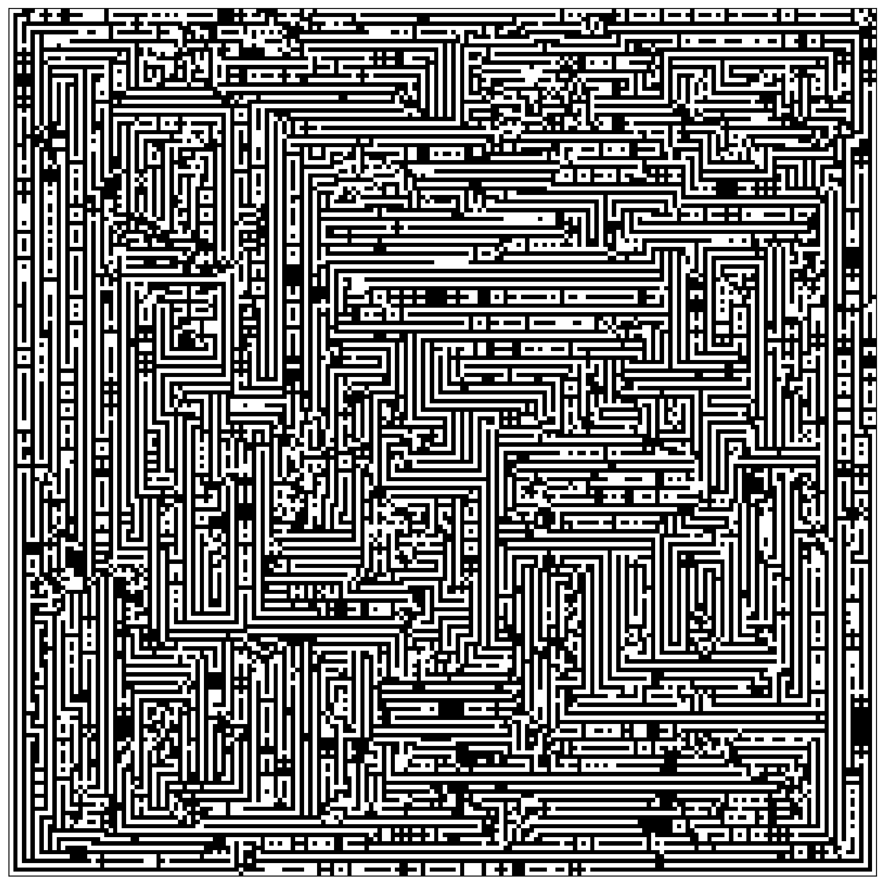
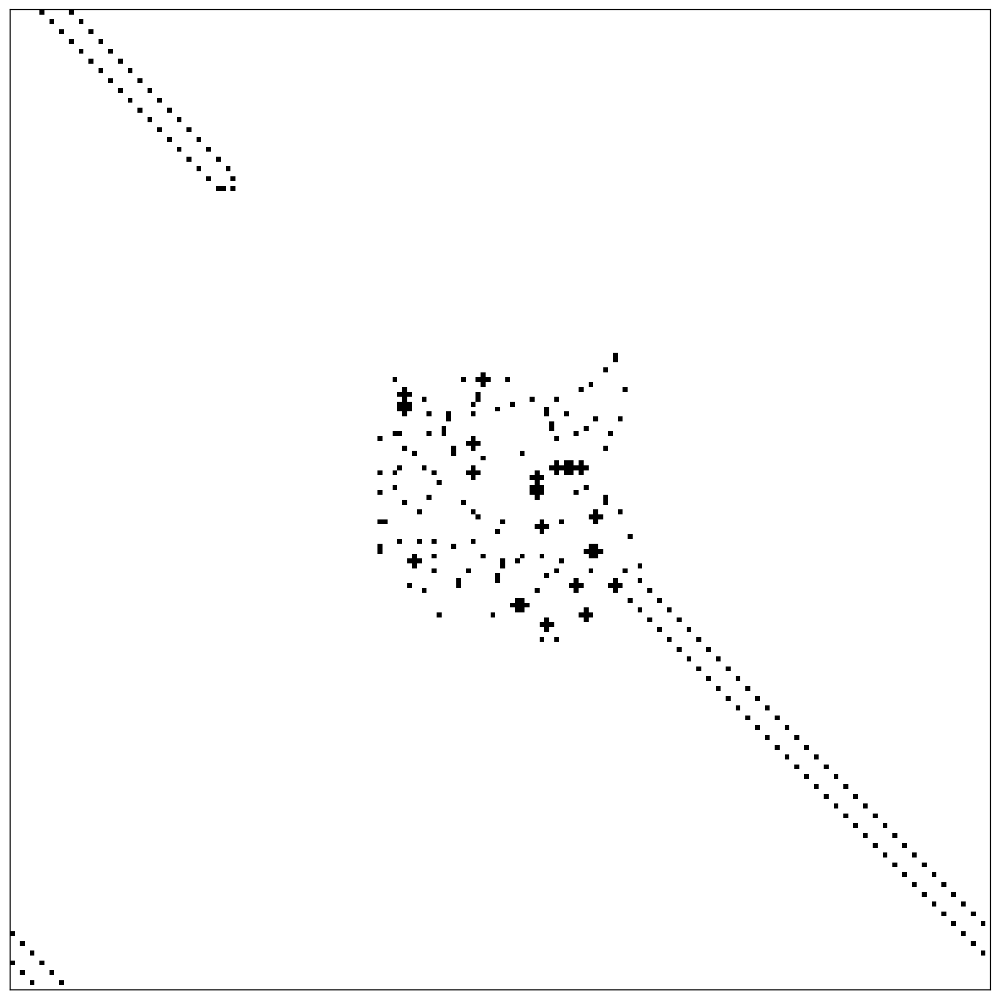
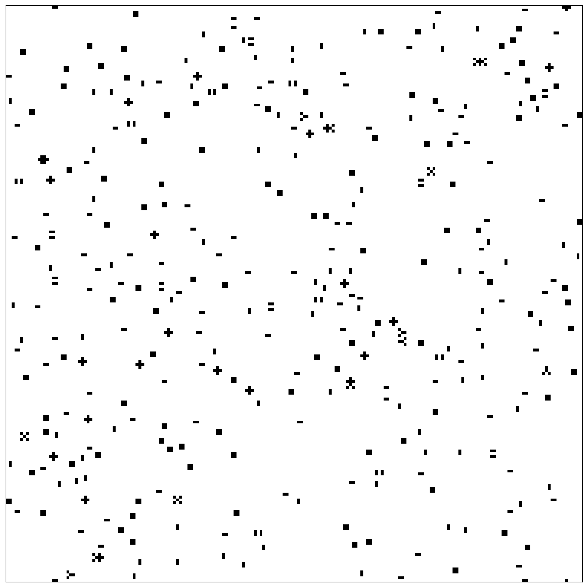

# Loren-CA



A quick implementation [this CA](https://bsky.app/profile/lorenschmidt.bsky.social/post/3lnnnrx3ea22l) originally created by [loren schmidt](https://bsky.app/profile/lorenschmidt.bsky.social).

Run the `protoype.py` file in `src` to generate outputs to the `out` folder.

## Eploration Notes

> Many seeds produce noise from noise

### SEED 9267

```python
rule = 
[[0, 2, 2, 1, 0],
 [0, 0, 1, 1, 2],
 [0, 1, 0, 1, 0],
 [2, 1, 0, 1, 2],
 [1, 2, 1, 1, 2]]
 ```

produces GOL style behaviour. If given a border of ones, can produce a glider-like formation along with stable-states/oscillators!



### SEED 82345

```python
rule = 
[[1, 2, 2, 0, 0],
 [2, 1, 2, 1, 1],
 [2, 2, 1, 2, 0],
 [2, 1, 0, 1, 2],
 [2, 2, 1, 2, 1]]
```

produces still lifes with some complicated shapes:


